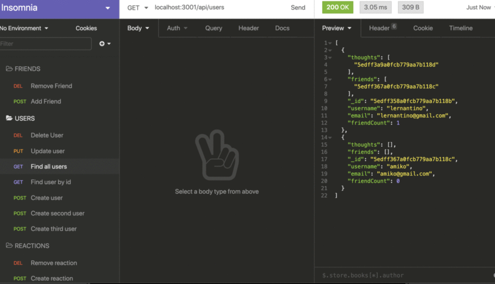
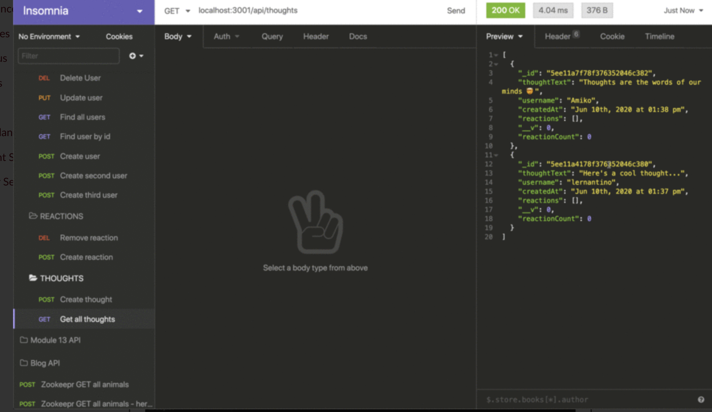
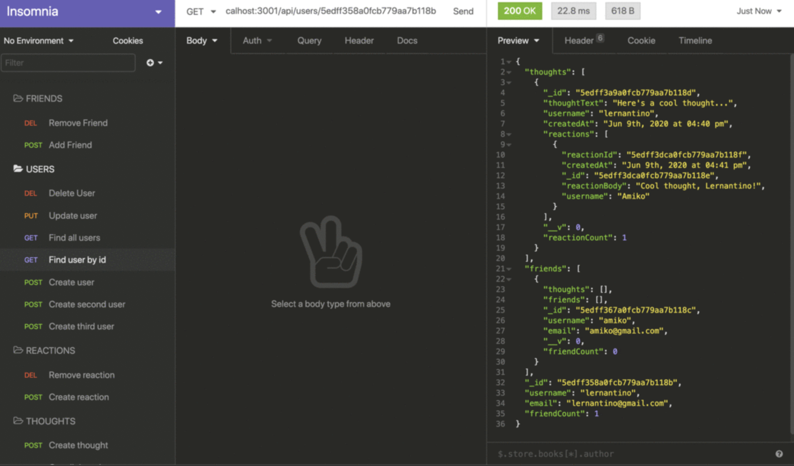
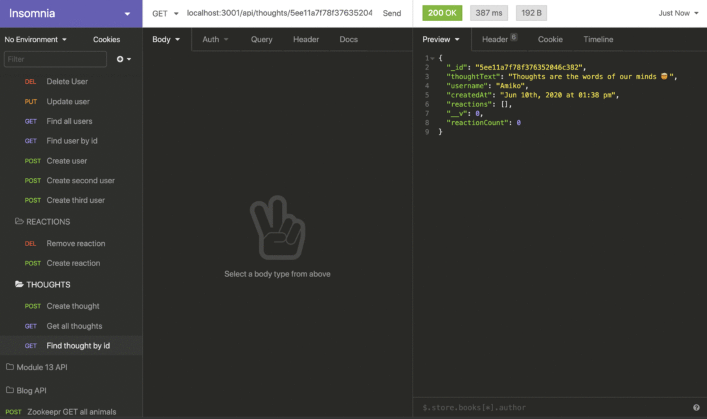

### Table of Contents

- [Description](#description)
- [Local Installation](#local-installation)
- [User Story](#user-story)
  - [Acceptance Criteria](#acceptance-criteria)
- [License](#license)

---

## Description

It's an API for a social network web application.


---

# Local Installation

1. Download or clone this repo to your local machine
2. Launch a terminal from the root of the same folder
3. Enter `npm install` to install all required packages and wait for them to complete
4. Enter `npm start` to initialize and launch the server.
5. Execute API calls to [http://localhost:3001](http://localhost:3001) via Insomnia or your API solution of choice!

[Back to Top](#table-of-contents)

---

# User Story

**AS A** social media startup... **I WANT** an API for my social network that uses a NoSQL database... **SO THAT** my website can handle large amounts of unstructured data

# Acceptance Criteria

```
GIVEN a social network API:

WHEN I enter the command to invoke the application
┗►THEN my server is started and the Mongoose models are synced to the MongoDB database

WHEN I open API GET routes in Insomnia for users and thoughts
┗►THEN the data for each of these routes is displayed in a formatted JSON

WHEN I test API POST, PUT, and DELETE routes in Insomnia
┗►THEN I am able to successfully create, update, and delete users and thoughts in my database

WHEN I test API POST and DELETE routes in Insomnia
┗►THEN I am able to successfully create and delete reactions to thoughts and add and remove friends to a user’s friend list
```

[Back to Top](#table-of-contents)


## Screen Shots



---


---


---


---

# License

MIT License

Copyright (c)

Permission is hereby granted, free of charge, to any person obtaining a copy
of this software and associated documentation files (the "Software"), to deal
in the Software without restriction, including without limitation the rights
to use, copy, modify, merge, publish, distribute, sublicense, and/or sell
copies of the Software, and to permit persons to whom the Software is
furnished to do so, subject to the following conditions:

The above copyright notice and this permission notice shall be included in all
copies or substantial portions of the Software.

THE SOFTWARE IS PROVIDED "AS IS", WITHOUT WARRANTY OF ANY KIND, EXPRESS OR
IMPLIED, INCLUDING BUT NOT LIMITED TO THE WARRANTIES OF MERCHANTABILITY,
FITNESS FOR A PARTICULAR PURPOSE AND NONINFRINGEMENT. IN NO EVENT SHALL THE
AUTHORS OR COPYRIGHT HOLDERS BE LIABLE FOR ANY CLAIM, DAMAGES OR OTHER
LIABILITY, WHETHER IN AN ACTION OF CONTRACT, TORT OR OTHERWISE, ARISING FROM,
OUT OF OR IN CONNECTION WITH THE SOFTWARE OR THE USE OR OTHER DEALINGS IN THE
SOFTWARE.


---


[Back to Top](#table-of-contents)
